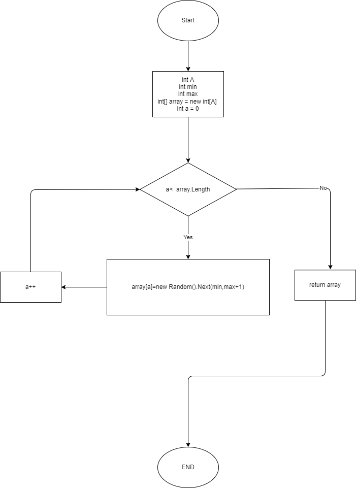
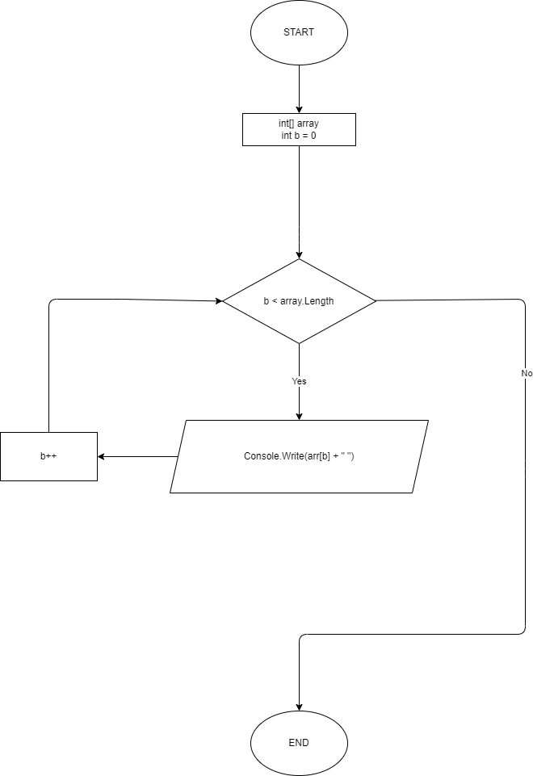
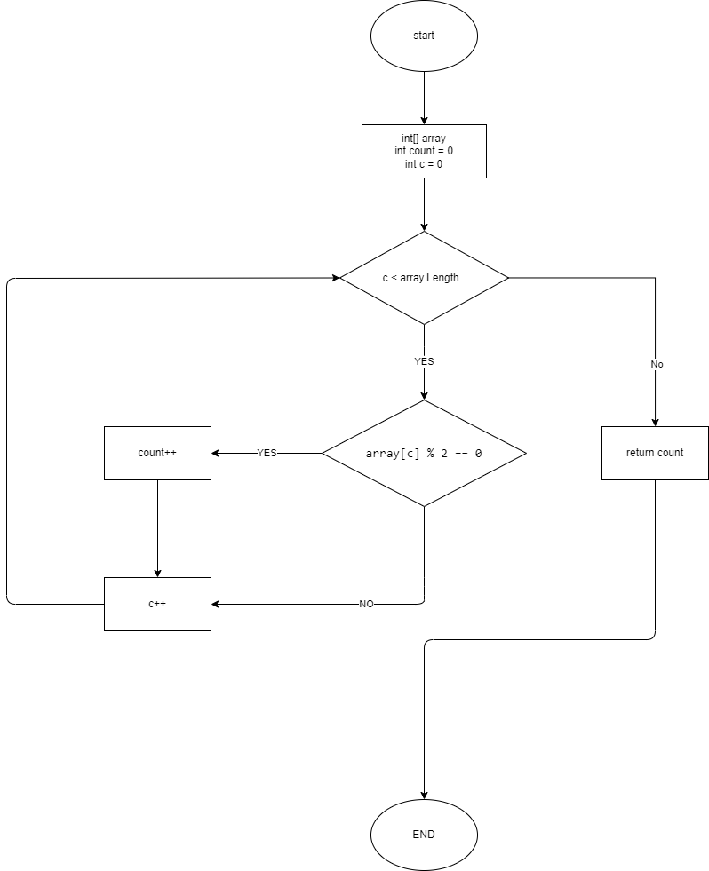
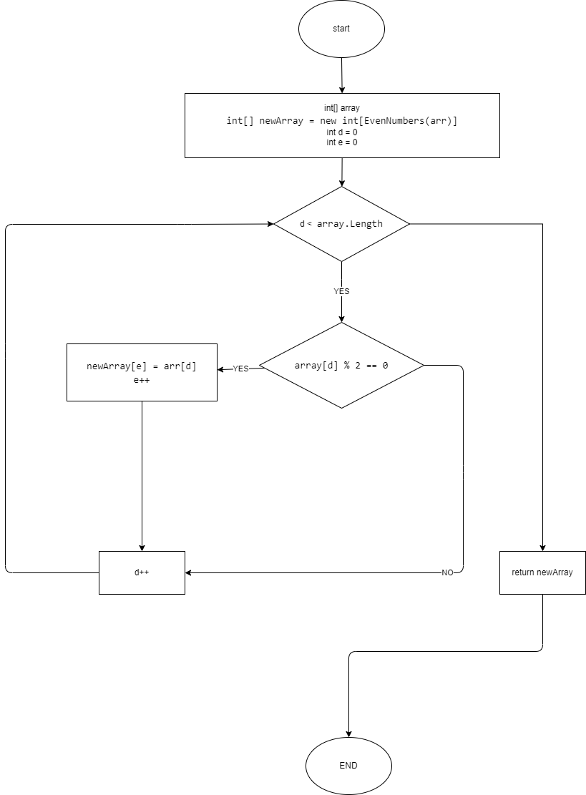

## Написать программу, которая из имеющегося массива целых чисел формирует массив из четных чисел. Первоначальный массив можно ввести с клавиатуры, либо сгенерировать случайным образом. При решении нерекомендуется пользоваться коллекциями, лучше обойтись исключительно массивами.

1.Создаём A - элементный массив и заполняеv случайными целыми числами из заданного диапазона  и возвращаем созданный массив.
<code>
</code>

2.Выводим на экран  заданный  в качестве аргумента массив.
<code>
</code>

3.Считаем и возвращаем количество чётных чисел в заданном массиве.
<code>
</code>

4.Формируем новый массив из целых чётных чисел взятых из заданного массива. Возвращаем новый массив.
<code>
</code>